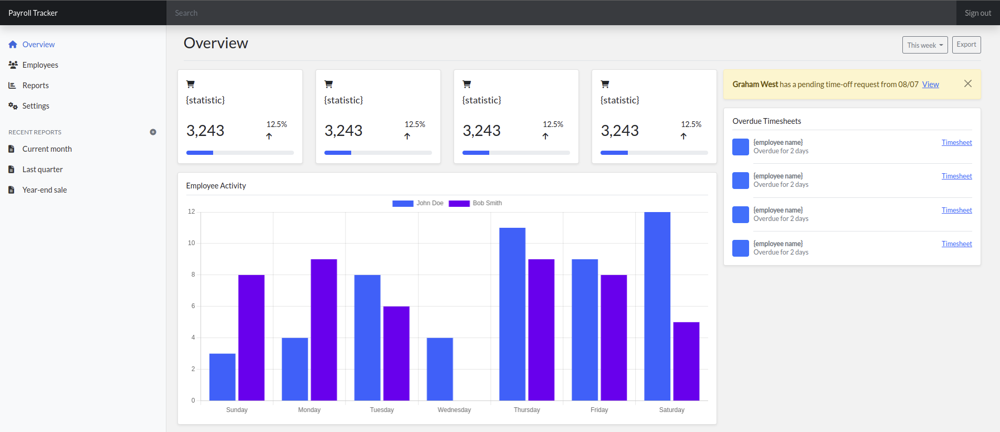
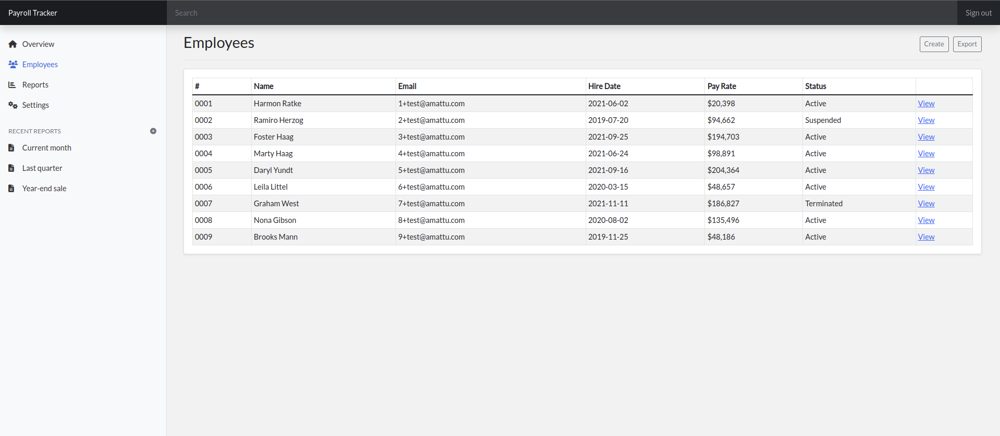
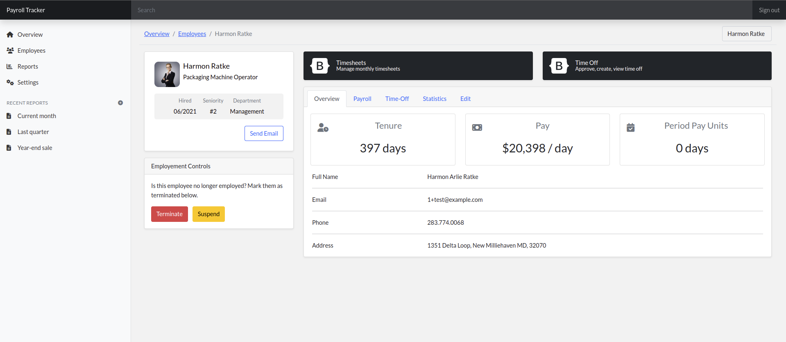
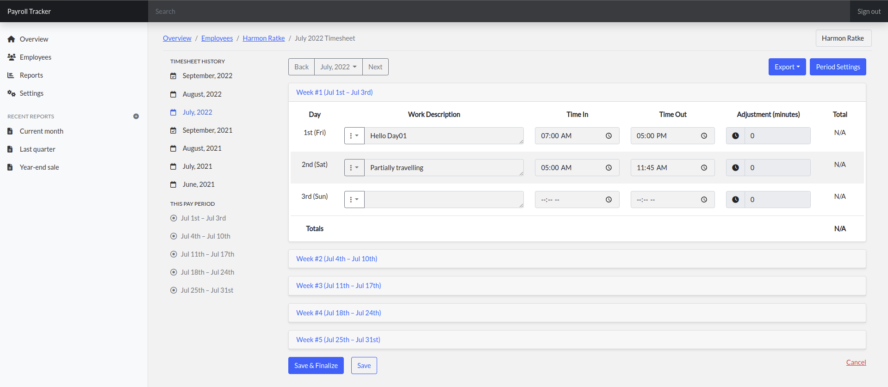
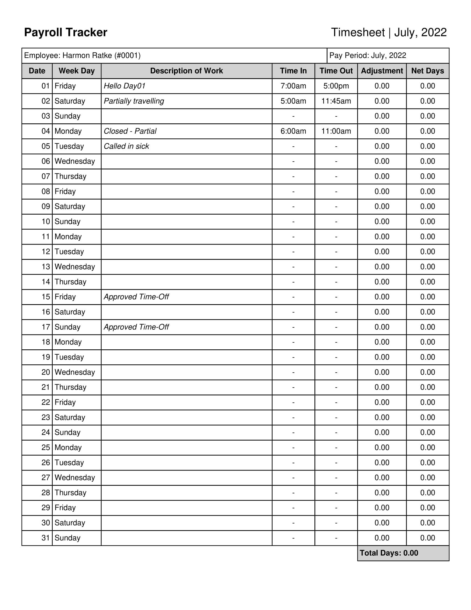
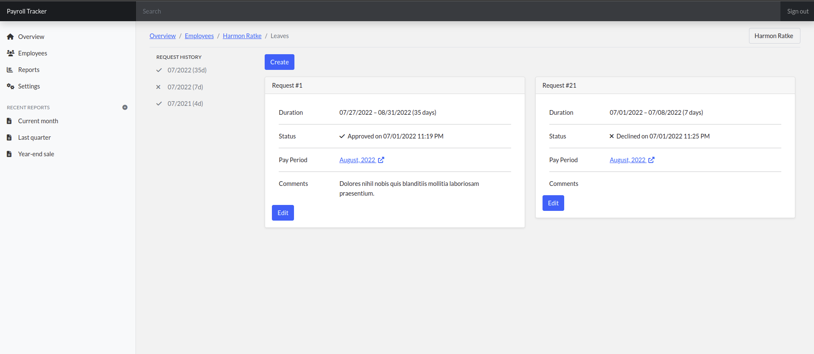

# Introduction

A comprehensive HR employee management and timekeeping system. Digitize timesheets, handle time-off requests, and automate standard onboarding procedures.

Abbreviated list of functionality:

- Employee management
- Linked employee accounts
- Track clock-in/clock-out times
- Finalize timesheets with automated notifications
- Manage leave/time-off requests

Coming Soon:

- Automate onboarding procedures with push notifications of hired/terminated employees
- Pre-built reports and employee insights
- Company/department closures and scheduling with notifications
- Supervisor/Department tracking

# To-Do

## App

- [ ] App Settings and Controls
- [ ] Navigation search bar (e.g. Employees, Timesheets, ...)

## Employees

- [ ] Create a user account for a employee
- [ ] Department assignments
- [ ] Supervisor tracking (e.g. Joan reports to Barry)
- [X] Internal comments / Notes
- [X] Profile picture display
- [ ] PTO cap and limit tracking
- [X] General profile editing
- [X] Employee Communication (e.g. Timesheets, Free form emails, PTO Rejections)
- [X] Time-Off Tracking / Requests

## Payroll / Timesheets

- [X] Editing timesheet options (e.g. Period/Pay type)
- [X] Time card tracking
- [ ] Time unit calculation by Day/Hours (including 1/4, 1/2, 3/4 days)
- [X] Exporting (PDF/Email)

## Reports

- [ ] Report Center
- [ ] Statistics/Graphs on pages
- [ ] Employee Statistics
- [ ] Overview Statistics

## Other

- [X] Block a user from logging in if their associated employee is not active
- [X] Heavy query caching (i.e. employees, timesheets)
- [X] Fix factories for tables with unique constraints (Timesheets, Timesheet Days)
- [X] Implement lang file for long/duplicated messages
- [X] When employees are terminated, reject all open PTO requests

# Requirements & Dependencies

- PHP 8+
- Laravel 9.X+
- MySQL
- Bootstrap 5.X+

# Previews

## Overview Page

## Employees Page

## Timesheets

## Leave/PTO Page

